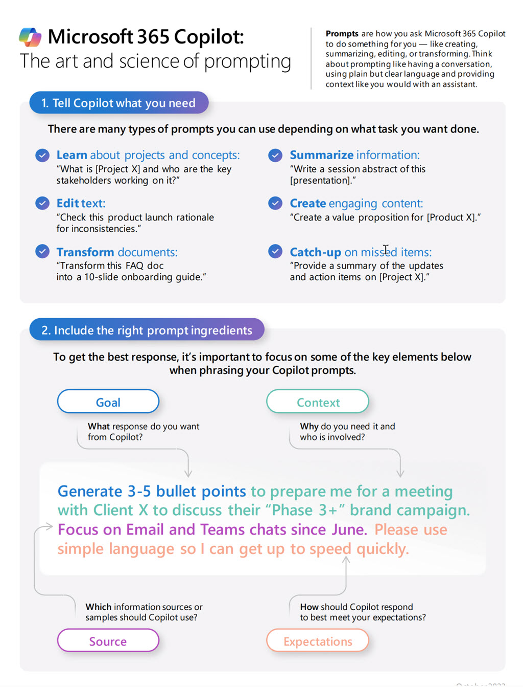

# Craft effective prompts for Microsoft Copilot for Microsoft 365

- Introduction to prompting Techniques
- Summarize with Microsoft Copilot for Microsoft 365
- Create and draft with Microsoft Copilot for Microsoft 365
- Edit and transform content with Microsoft Copilot for Microsoft 365
- Ask questions and analyze content with Microsoft Copilot for Microsoft 365

## Links & Resources

[Copilot Lab](https://copilot.cloud.microsoft/en-US/prompts)

[The art and science of prompting](https://adoption.microsoft.com/files/copilot/Prompt-ingredients-one-pager.pdf)

