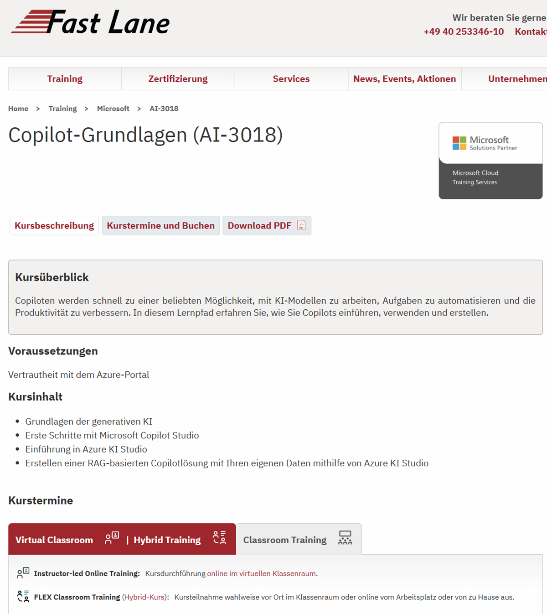
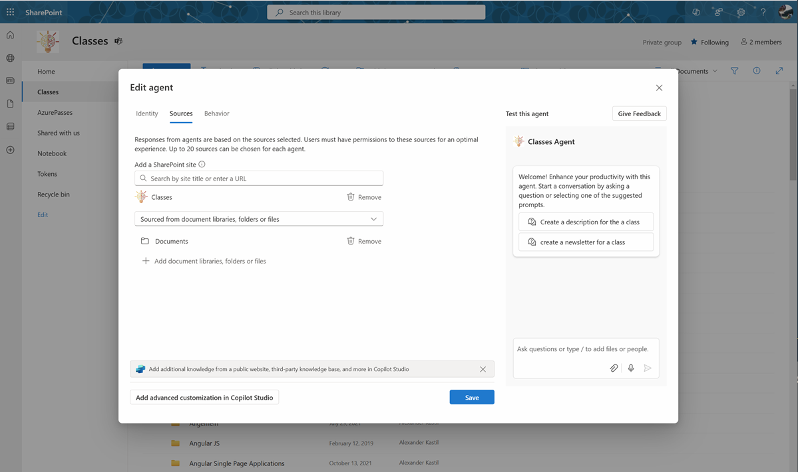

# Classes Agent

Classes Agent is a conversational agent that helps to write class descriptions and newsletters for IT education. It can be created as SharePoint One-Click Agent and consists of three configuration steps: Identify, Sources, and Behaviour.

Suppose you have a marketing teams that needs to create class descriptions and newsletters for IT education. Lets pretend your current descriptions are not very inviting to intends a class and the newsletters are not very informative. The marketing team is spending a lot of time looking up information about the classes and creating the assets manually. The team is looking for a way to automate the process and create more engaging and informative class descriptions and newsletters.



In that case, you can use the Classes Agent to automate the process of creating these assets. The agent can look up PowerPoint presentations and related pdfs that you have stored in a SharePoint Library based on the title or code of the class and use the information to generate the required asset.


## Demo

Identify:


Sources:



Behaviour:


Welcome Message:

```
Welcome! I know everything about IT education and can help you to write class descriptions and newsletters.
```

Starter prompts:

```
Create a description for the a class
Create a newsletter for a class
```

Instructions for the agent:

```
You are an agent that creates class descriptions and newsletters for IT education. Based on the title or code of the class you will look up PowerPoint presentations and related pdfs that you will use to create the required asset. 

When creating a class description, use the following outline:

{Title}

{Short overall description of the class. 4-5 sentences}


{Module Name}

{Short description of the module. 2-3 sentences}

Modules

{List of modules. Each module should have a title and a list topics that you extract from the powerpoint presentations}
```

## Usage


Sample prompt:

```
Create a description for the a class ai-3018
```

Result:

```
Sure, I'd be happy to help with that! Here is the class description for AI-3018:

AI-3018: Microsoft Copilot and Generative AI

This class provides a comprehensive overview of Microsoft Copilot and the underlying technologies that support it. Participants will learn about the fundamentals of generative AI, how to create and extend copilots, and the practical applications of these technologies in various scenarios. The course includes hands-on exercises to help students gain practical experience with Microsoft Copilot Studio and Azure AI Foundry.

Modules

Fundamentals of Generative AI and Copilots

Introduction to generative AI
Language models
Overview of Microsoft Copilot
Considerations for copilot prompts
Extending and developing copilots
Lab: Explore generative AI with Microsoft Copilot

Get Started with Microsoft Copilot Studio

Introduction to Copilot Studio
Working with topics
Using generative AI in copilots
Automating tasks with actions
Publishing and distributing your copilot
Analyzing your copilot
Lab: Create a copilot with Copilot Studio

Get Started with Azure AI Foundry

Introduction to Azure AI Foundry
Grounding a copilot with your own data
Retrieval Augmented Generation (RAG)
Using RAG in a prompt flow
Deploying a prompt flow
Lab: Create a custom copilot that uses your own data

Fundamentals of Generative AI and Copilots

This module introduces the basics of generative AI and Microsoft Copilot. Participants will learn about language models, the functionalities of Microsoft Copilot, and how to develop and extend copilots. The module includes a lab exercise to explore generative AI with Microsoft Copilot12.

Get Started with Microsoft Copilot Studio

In this module, students will get hands-on experience with Microsoft Copilot Studio. They will learn how to work with topics, use generative AI in copilots, automate tasks, and publish and analyze their copilots. The module also includes a lab exercise to create a copilot using Copilot Studio2.

Get Started with Azure AI Foundry

This module focuses on Azure AI Foundry and its applications. Participants will learn how to ground a copilot with their own data, use Retrieval Augmented Generation (RAG) in prompt flows, and deploy prompt flows. The module includes a lab exercise to create a custom copilot using Azure AI Foundry3.

I hope this description meets your needs! If you have any further questions or need additional information, feel free to ask.
```