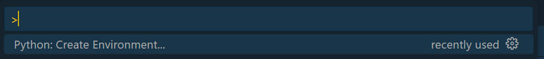

# Messaging Extensions

[Messaging Extensions](https://docs.microsoft.com/en-us/microsoftteams/platform/messaging-extensions/what-are-messaging-extensions)

[Cards Docs](https://docs.microsoft.com/en-us/microsoftteams/platform/task-modules-and-cards/cards/cards-reference)

[Microsoft 365 Teams Developer Portal / Tools / Bot Management - https://dev.teams.microsoft.com/bots](https://dev.teams.microsoft.com/bots)

## Demos

### Use Langchain in Azure Function Python

This demo shows how to create a Function App using Python and LangChain.

- Install the [Python Environment Manager](https://marketplace.visualstudio.com/items?itemName=donjayamanne.python-environment-manager) extension in Visual Studio Code.

- Setup the environment using F1 - Create Python Environment.

    

- Select Venv as the environment and select the Python version (3.11). Install packages using pip.

      
