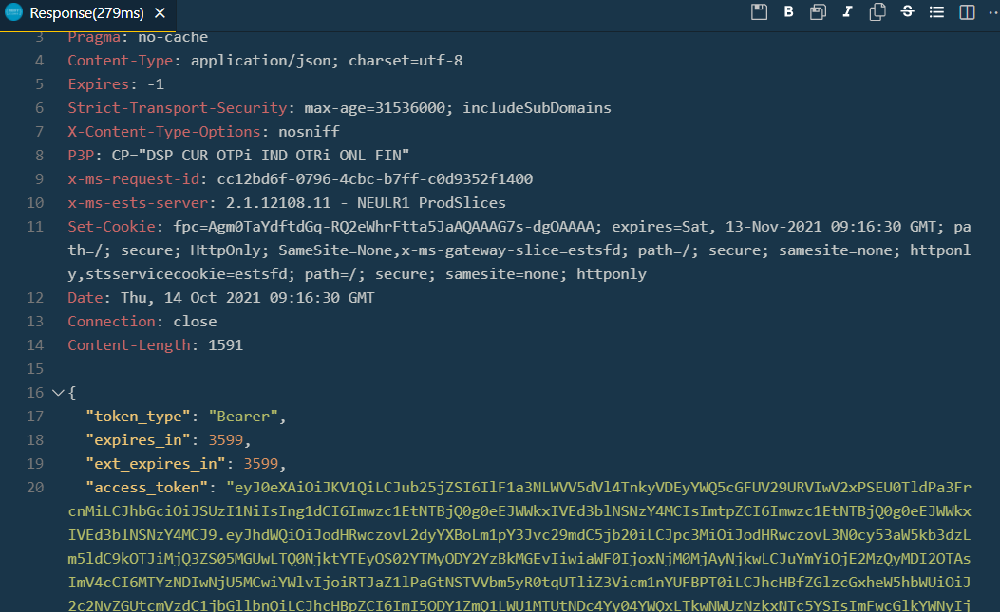

# REST Client

[REST Client VS Code Extension](https://marketplace.visualstudio.com/items?itemName=humao.rest-client)

To support Auth create an app registration in Azure AD using `create-appreg.azcli`.

Persist the output into your VS Code `settings.json`:

```json
"rest-client.environmentVariables": {
        "$shared": {},
        "blogdemo":{
            "tenantId":"<<your aad tenant>>",
            "clientId":"<<your client id>>",
            "clientSecret":"<<your client secret>>",
            "scope":"https%3A%2F%2Fgraph.microsoft.com%2F.default"
        }     
    }
```

Assign the `User.ReadAll` permissions for out test as an Application Permission


>Note: If you need additional permission you will have to assign them using the app registrations "API Permissions" tab

To test choose "F1" -> "REST Clien: Switch Environment" and execute `get-token.http`. The response is stored in the `auth` variable.

```
# @name auth
POST https://login.microsoftonline.com/{{tenantId}}/oauth2/v2.0/token HTTP/1.1
Content-type: application/x-www-form-urlencoded

grant_type=client_credentials
&client_id={{clientId}}
&client_secret={{clientSecret}}
&scope={{scope}}
```



Use `auth` variable from prev. step and list all users in the tenant

```
GET https://graph.microsoft.com/v1.0/me
Authorization: Bearer {{auth.response.body.access_token}}
```